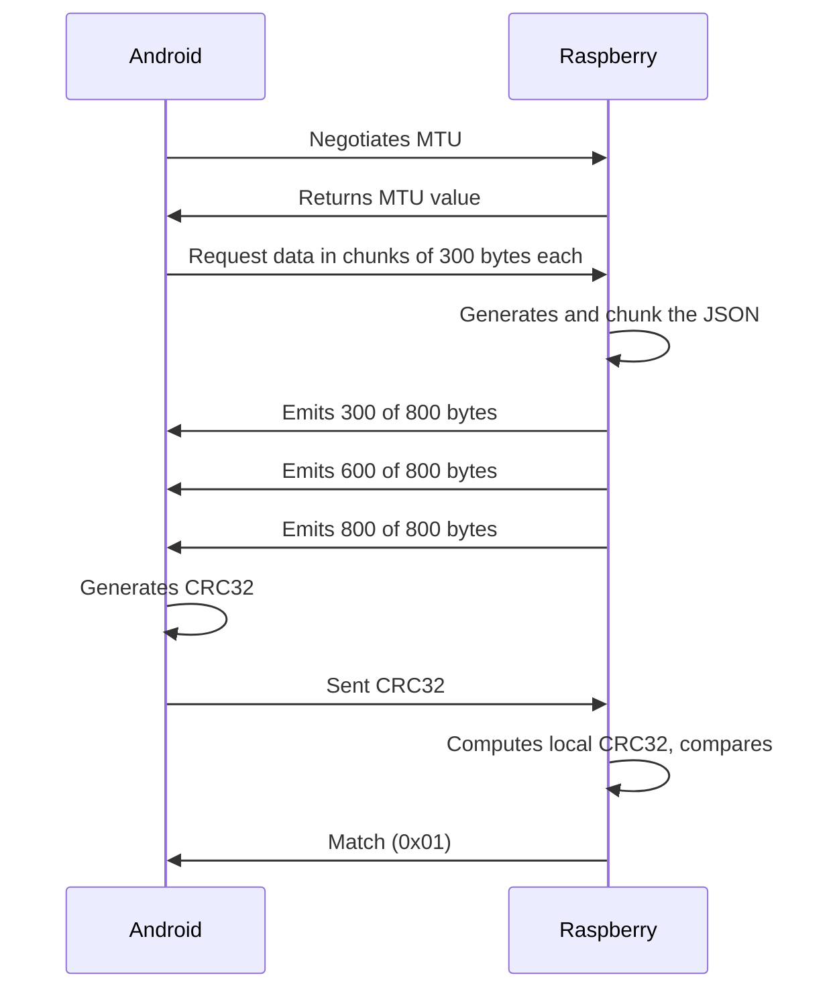
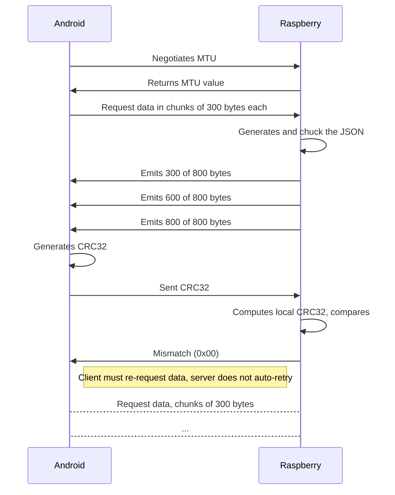

<!-- Synced from the Obsidian vault via /sync-protocol-documents. Edit the source there, not this file directly. -->

# The problem
The app needs the list of wifi networks **as seen by the Raspberry PI**, not by the phone. 

This creates a transport problem. A wifi scan result is a variable-length list of structured data, maybe ~3KB of data.
However, MTU packets move at most ~514 bytes after negotiation. The payload might not fit in one packet.

So the data must be split in N chunks to transfer sequentially to the client while ensuring integrity.

## Why JSON
This protocol absorbs any schema without changes in transport layer.
The JSON data is more readable that fixed bytes-data, making easier the debugging from the client side.

# Architecture
The transport layer is exposed in a new service `290edf15-b540-4e83-83cf-ba647bf4df30` that uses the following characteristics:

## Characteristics
### Request data
For requesting JSON-based data, we need two characteristics: One for reset the offset and another for actually request the chunks of data, for convenience, both characteristics share the same UUID, but have the following rules:
- reset offset -> `write type`
- request data -> `read type`

The reset must happens before requesting the data, because the GATT server stores on memory the pointer/offset used during the streaming.

All **reset** calls have the following structure during the writing:

| Position | Field | Usage |
| --- | --- | --- |
| 4 bytes | chunk size | Expected chunk size, every chunk has this size during the emission, taking in consideration the headers and the content<br><br>This value should come from the negotiated MTU, where:<br>$chunkSize = negotiatedMTU - ATTHeaderSize - chunkHeaderSize$<br><br> $ATTHeaderSize$: 3 bytes - The ATT PDU (Protocol Data Unit) header prepend on every packet by the Low level bluetooth protocol<br><br> $chunkHeaderSize$: 4 bytes<br><br> So for a MTU of **514 bytes**, the chunkSize is $514 bytes - 3 bytes - 4 bytes = 507 bytes$<br> |
| 4 bytes | offset | The offset where the emission should start, this value starts from 0 to the total of bytes of the complete JSON.<br>Starting from 0 indicates a fresh emission, but we can resume the emission by using a value greater that 0, we can also sent the total of bytes of the complete JSON or above, but there won't be any data to transmit, so is kind of useless |

After correctly resetting or resuming the offset, we start reading any **request data** characteristic until the transmission is done, so we can reassemble the complete data into a valid JSON

Every returned chunk uses the following structure:

| Position | Field | Usage |
| --- | --- | --- |
| 2 bytes | current offset | Expressed in little-endian, we use this value to know how many data we have received and how many chunks are left to reassemble the data |
| 2 bytes | total size of the complete JSON | Expressed in little-endian, this value is the bytes used for the data before chunked |
| The rest of the bytes | content | This value is a portion of the complete JSON |

So **C8 00 08 07 C4 00 01 B8 12 E9 BF FF 01 12 00** Can be interpreted as:
- Current offset: **C8 00**, 200 bytes of progress
- Total size: **08 07**, 1800 bytes of total size
- Content: **C4 00 01 B8 12 E9 BF FF 01 12 00**

> [!IMPORTANT]
> The default MTU size in android is 23 bytes, after subtracting the 3-byte ATT header, that leaves 20 usable bytes per packet, and only 16 content bytes after the 4 data-emission bytes
> The max MTU value is 517 bytes, having 514 usable bytes (510 content bytes per chunk)

**TODO**:
```
The offset for chunk N (1-indexed) must be computed from the content-only portion of the chunk, not the full chunk size:
$offset = (N - 1) \times (chunkSize - chunkHeaderSize)$

Using $chunkSize$ directly (i.e. including the 4-byte header) causes drift: only $chunkSize - chunkHeaderSize$ bytes of each chunk are real JSON content, so after $N$ chunks the actual amount of content delivered is $N \times (chunkSize - chunkHeaderSize)$, not $N \times chunkSize$. Resuming with the wrong formula skips ahead into content that hasn't been sent yet, and the gap grows by $chunkHeaderSize$ bytes per chunk already transmitted — corrupting the reassembled JSON on any resumed transfer.

Example: for a 20-byte chunk size (16 content bytes + 4 header bytes), after 5 chunks the real content position is $5 \times 16 = 80$, not $5 \times 20 = 100$.
```


#### Transmission done
Assuming a chunk size of **20 bytes**, the last transmitted chunk should looks like this:

| Field | Raw bytes | Decoded |
| --- | --- | --- |
| current offset |  | 2000 |
| total size |  | 2100 |
| content |  | status" : "done"} |

If we set the offset to something equal or greater than **total size**, then we expect an empty chunk:

| Field | Raw bytes | 28 |
| --- | --- | --- |
| current offset |  | 2100 |
| total size |  | 2100 |
| content |  |  |


### Verify Integrity
**Write/Read** characteristic `290edf15-b540-4e83-83cf-ba647bf4df33` that is sent after the emission is completed.

For **Write**, it receives a **CRC32** code generated based on the complete data, the gatt server generates the same code, so it verifies the value sent from the client match.
- 16 bytes: Checksum value, little-endian

For **Read**, it returns whether the sent **CRC32** match with GATT server one, or if the content is corrupt
- 0x00: Corrupted info
- 0x01: Data transmitted successfully

> [!IMPORTANT]
> Integrity verification is optional - A client may skip it and rely solely on the offset/total bytes accounting from the Data emission to assume completeness
## Mobile and Peripheral interactions
Successful transfer


Failed transfer
